<p align="center">
  
</p>

# Buffy the Vampire Slayer: Chaos Bleeds — PC Port

This is a native Windows port of the 2003 Xbox game *Buffy the Vampire Slayer: Chaos Bleeds*. It isn't an emulator. The game's code is translated to C with [xboxrecomp](https://github.com/sp00nznet/xboxrecomp) and built into an ordinary Windows program. It uses Direct3D 11 for graphics, DirectSound for audio and XInput for controllers.

It also adds:

- **Sharp resolutions**: 720p, 1080p, 1440p and 4K, plus the original 4:3 sizes.
- **A steady 60 fps**, with VSync on or off.
- **A launcher** that installs, configures and starts the game.
- **Mods**: switch them on and off with a checkbox. The mods don't change the game files on disk.
- **Story co-op**: a second player can join the campaign, in two windows or on a split screen.

> [!IMPORTANT]
> **This repository has no game in it.** It holds no disc image, XBE, game data, movies or game code. You need your **own copy of the Xbox game**. Make a disc image of it (`.iso` or `.xiso`), then point the launcher at that image.

> [!NOTE]
> **This port was made with [Claude Code](https://claude.com/claude-code)**, Anthropic's AI coding assistant. Claude Code wrote most of the port's code, tools and docs, working with the project's human author, who directed, tested and played it. See [Contributors](#contributors).

---

## Screenshots

<table>
  <tr>
    <td width="50%">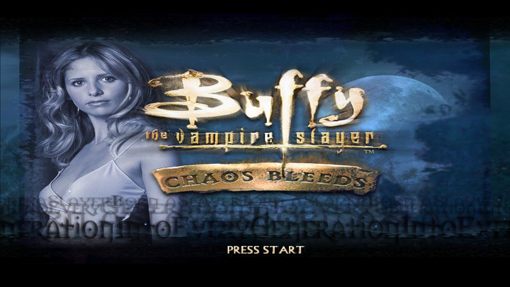<br><sub><b>Title screen</b>, at 1080p</sub></td>
    <td width="50%">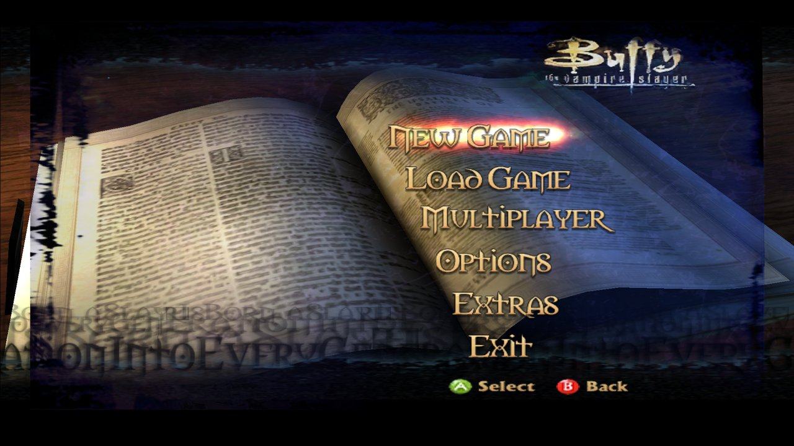<br><sub><b>Main menu</b>, the game's own spell-book menu</sub></td>
  </tr>
  <tr>
    <td>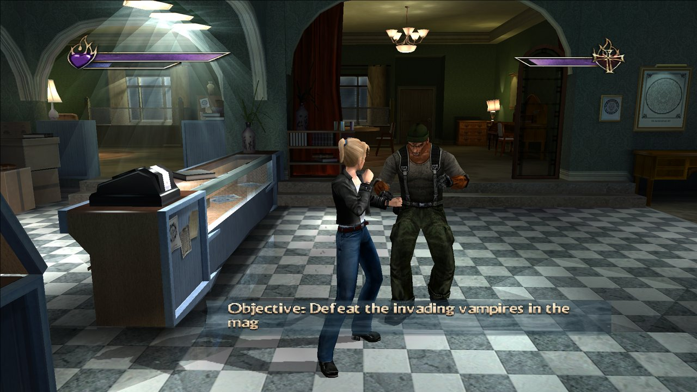<br><sub><b>The Magic Box</b>, in widescreen at 1080p and 60 fps</sub></td>
    <td>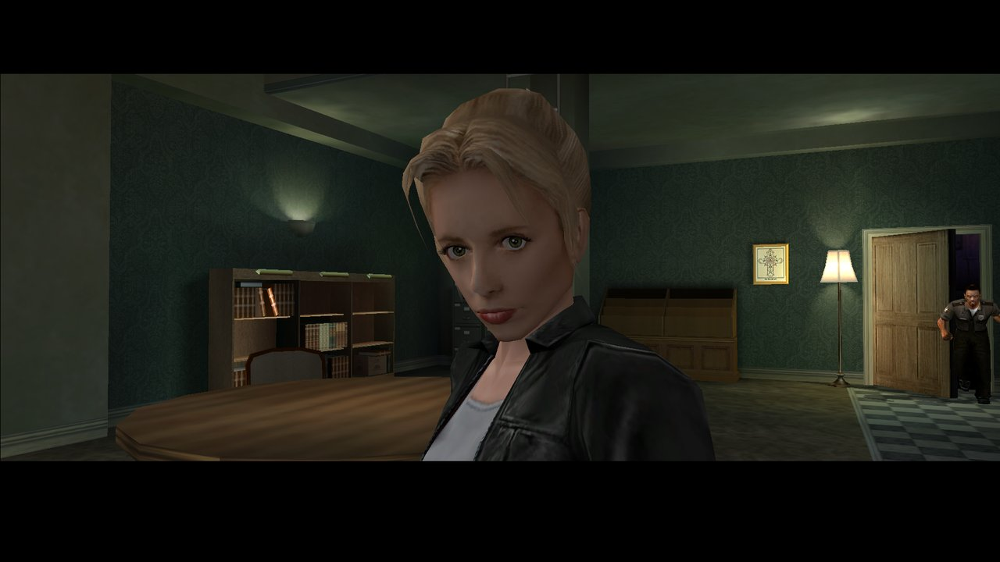<br><sub><b>In-engine cutscene</b></sub></td>
  </tr>
  <tr>
    <td>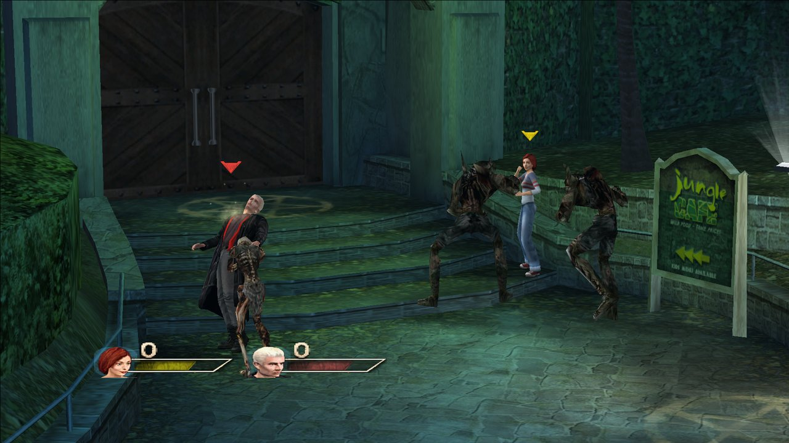<br><sub><b>Multiplayer</b>, with up to four controllers</sub></td>
    <td>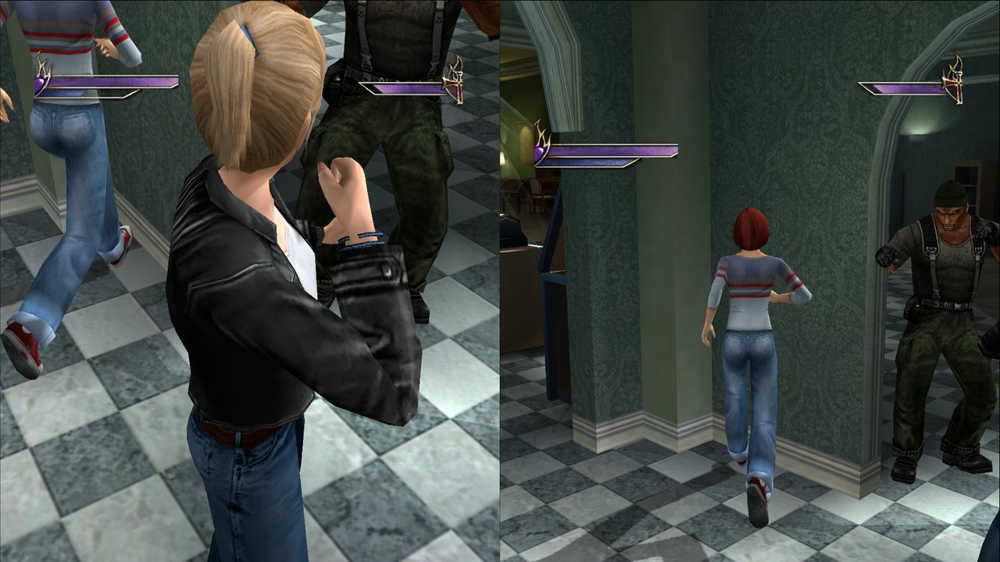<br><sub><b>Story co-op</b>, on a split screen</sub></td>
  </tr>
</table>

---

## Contents

- [Screenshots](#screenshots)
- [What you need](#what-you-need)
- [Install and play](#install-and-play)
- [Controls](#controls)
- [Settings](#settings)
- [Mods: what each one does](#mods-what-each-one-does)
- [Story co-op guide](#story-co-op-guide)
- [Building from source](#building-from-source)
- [Troubleshooting](#troubleshooting)
- [Contributors](#contributors)
- [Legal and credits](#legal-and-credits)

---

## What you need

| | |
|---|---|
| 💿 **The game** | A disc image of your own *Chaos Bleeds* **Xbox** disc, as an `.iso` or `.xiso`. The PS2 and GameCube versions won't work. |
| 🖥️ **PC** | Windows 10 or 11 (64-bit), with a graphics card that supports Direct3D 11. |
| 💾 **Disk space** | About 4 GB for the installed game. |
| 🎮 **Controller** | Optional. Any XInput (Xbox-style) pad works, and so does the keyboard. Co-op needs a second controller. |
| 🎬 **FFmpeg** | Optional. It's only used once, during install, to convert the game's movies for PC. The launcher can download it for you. |

---

## Install and play

<p align="center">
  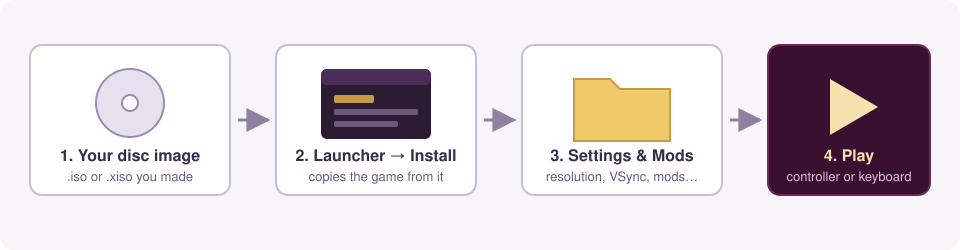
</p>

1. **Make a disc image** of your Xbox game disc, as an `.iso` or `.xiso`.
2. **Open `Buffy Launcher.exe`** and go to the **Install** tab:
   1. Under **Disc image**, choose your `.iso` or `.xiso`.
   2. Under **Install to**, choose an empty folder.
   3. Leave **Convert the game's movies** ticked to keep the cutscene movies. If FFmpeg isn't found, click **Download FFmpeg**.
   4. Click **Install**. The launcher only reads the image and never changes it. It copies the game out (about 4 minutes) and sets up the PC version beside it.
3. **Settings tab**: pick windowed or fullscreen, the resolution, VSync and so on.
4. **Mods tab**: tick any mods you want. See the [mods table](#mods-what-each-one-does).
5. **Play tab**: press **Play**.

Your saves go to `SaveData\` inside the game folder.

<table>
  <tr>
    <td width="50%">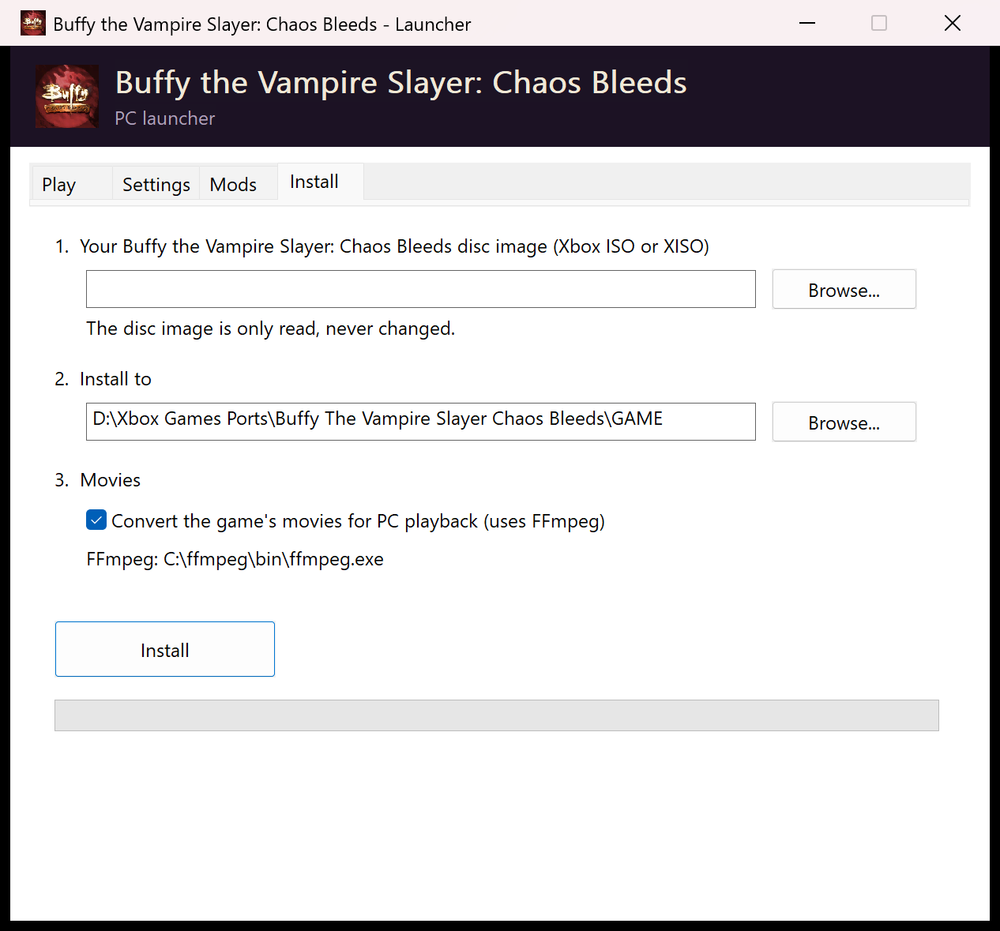<br><sub><b>Install</b>: choose your disc image and a folder</sub></td>
    <td width="50%">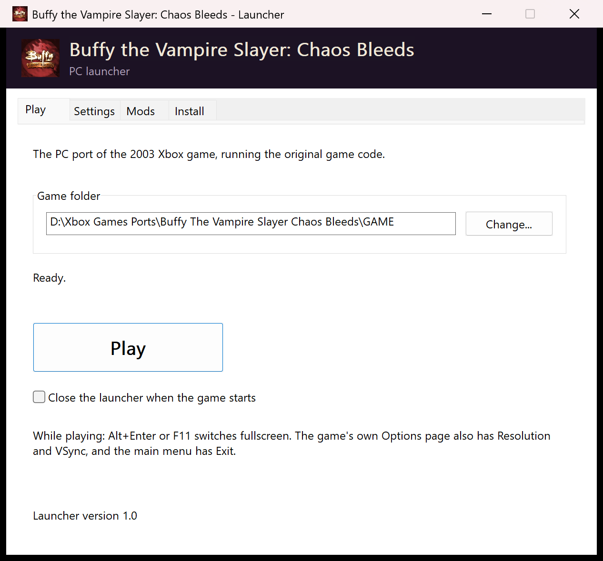<br><sub><b>Play</b></sub></td>
  </tr>
</table>

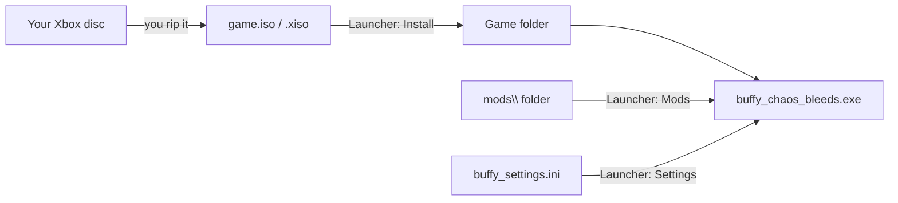

---

## Controls

Up to **four** XInput controllers work, in any USB or wireless slot. The first controller is player 1, and so is the keyboard. The next controller is player 2, and so on. Each player's pad gets its own rumble.

| Xbox button | Controller | Keyboard |
|---|---|---|
| Start | Start | `Enter` |
| Back | Back | `Esc` |
| A / B / X / Y | A / B / X / Y | `Space` / `Backspace` / `E` / `Q` |
| Black / White | LB / RB | `Z` / `C` |
| Left / right trigger | LT / RT | `Left Shift` / `F` |
| Left stick (move) | Left stick | `W` `A` `S` `D` |
| Right stick (camera) | Right stick | `I` `J` `K` `L` |
| D-pad | D-pad | Arrow keys |

**While playing:**

- `Alt+Enter` or `F11` switches between windowed and fullscreen.
- Closing the window quits the game.
- The window title shows the frame rate.

---

## Settings

You can change these in the launcher's **Settings** tab. The **Resolution** and **VSync** options are also on the game's own **Options** page. Everything is saved in `buffy_settings.ini` beside the exe.

| Setting | What it does |
|---|---|
| **Windowed / Fullscreen** | Fullscreen is borderless. |
| **Resolution** | 1920×1080 is the default. 1280×720, 2560×1440 and 3840×2160 are also 16:9. The original 4:3 sizes are 640×480, 1280×960, 1920×1440 and 2560×1920. Menus and movies stay 4:3, with bars at the sides. |
| **VSync** | Waits for the monitor's refresh, so the picture doesn't tear. |
| **Widescreen: keep the original side-to-side view** | On by default. It shows the original view with the top and bottom trimmed, which avoids pop-in and clipping at the edges of the screen. Untick it for the game's own wider view. |
| **Skip the intro movies** | Goes straight to the title screen. |
| **Invert camera left / right** | Flips the right stick's horizontal direction. |

<p align="center">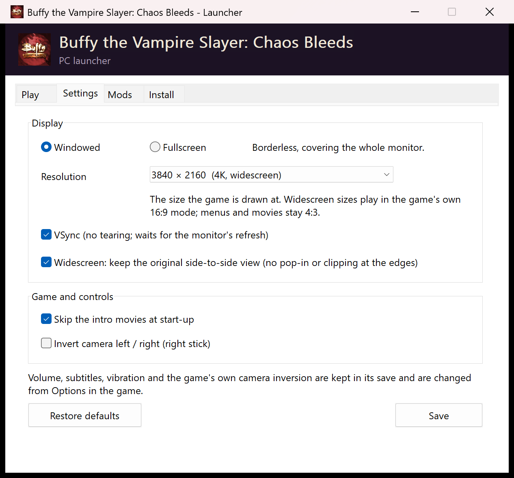</p>

---

## Mods: what each one does

<p align="center">
  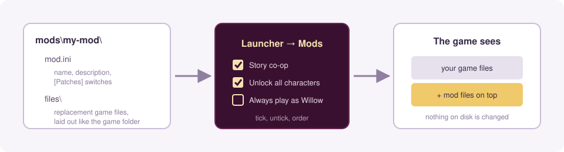
</p>

Mods live in the game folder's `mods\` folder. Tick them in the launcher's **Mods** tab and click **Apply mods**. A mod is laid *over* the game files and never written into them, so unticking it removes it completely. **None of these mods change your saves.**

<p align="center">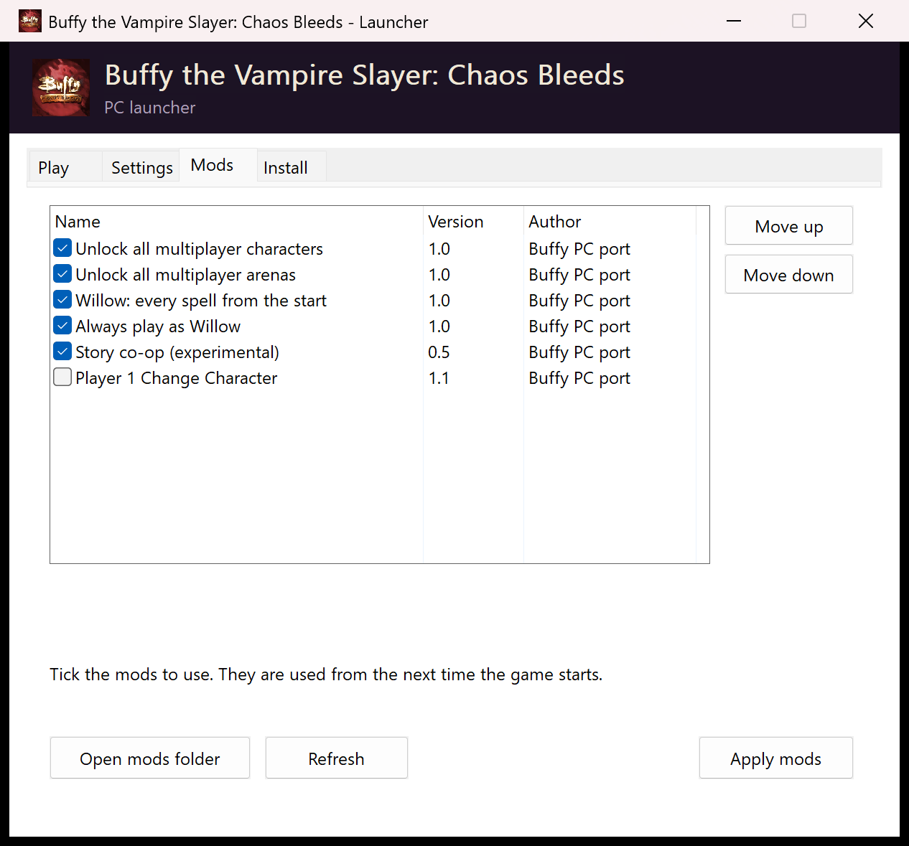</p>

| Mod | What it does | Works in |
|---|---|---|
| 🧛 **Story co-op** *(experimental)* | A second player joins the story. Press **Start on controller 2** during a level and pick any of the **24 characters**. Both players share one inventory, and each gets their own camera, pause menu and window. See the [co-op guide](#story-co-op-guide). | Story |
| 🔄 **Player 1 Change Character** | Adds **Change Character** to player 1's pause menu. You can carry on the story as any of the 24 characters. | Story |
| 🧙 **Always play as Willow** | You play every story level as Willow, whoever the level normally uses. A level built around another character's abilities may be harder as Willow, or impossible to finish. | Story |
| ✨ **Willow: every spell from the start** | Willow has all **14 spells** from her first level instead of learning them as the story goes on. | Story and multiplayer |
| 👥 **Unlock all multiplayer characters** | Every character on the multiplayer Character Select can be picked without unlocking them in the story first. | Multiplayer |
| 🗺️ **Unlock all multiplayer arenas** | Every arena on the multiplayer Arena Select is open. | Multiplayer |

<details>
<summary><b>Making your own mod</b></summary>

```
mods\
  my-mod\
    mod.ini          name, description, optional [Patches] switches
    files\           replacement game files, laid out like the game folder
      Buffy\...
```

Here's an example `mod.ini`:

```ini
[Mod]
Name = My mod
Author = You
Version = 1.0
Description = What it does, in one or two sentences.

[Patches]
; optional switches built into the port:
; UnlockAllMultiplayerCharacters, UnlockAllMultiplayerArenas,
; UnlockAllWillowSpells, AlwaysPlayAsWillow,
; StoryCoop, StoryCoopScreens (1/2/3), Player1ChangeCharacter
```

The launcher's order decides which mod wins if two mods replace the same file. Use **Move up** and **Move down** to change the order. `mods\README.txt` in the installed game has the full details.

</details>

---

## Story co-op guide

<p align="center">
  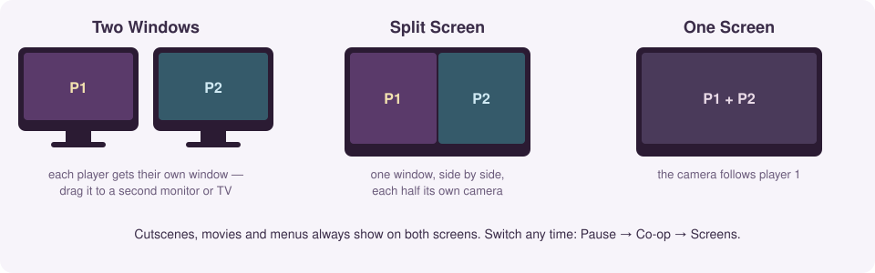
</p>

<p align="center">
  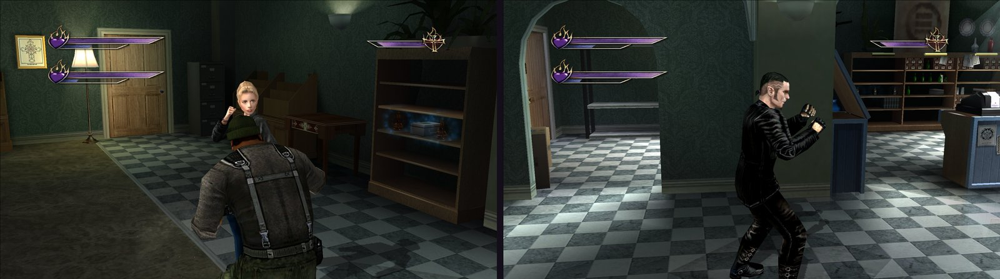<br>
  <sub><b>Two Windows</b>: player 1's window (left) and player 2's (right), each with its own camera</sub>
</p>

<table>
  <tr>
    <td width="50%">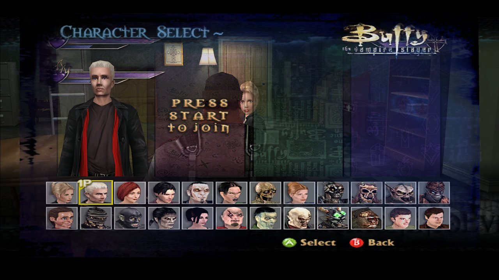<br><sub>Player 2 presses <b>Start</b> and picks from all 24 characters</sub></td>
    <td width="50%">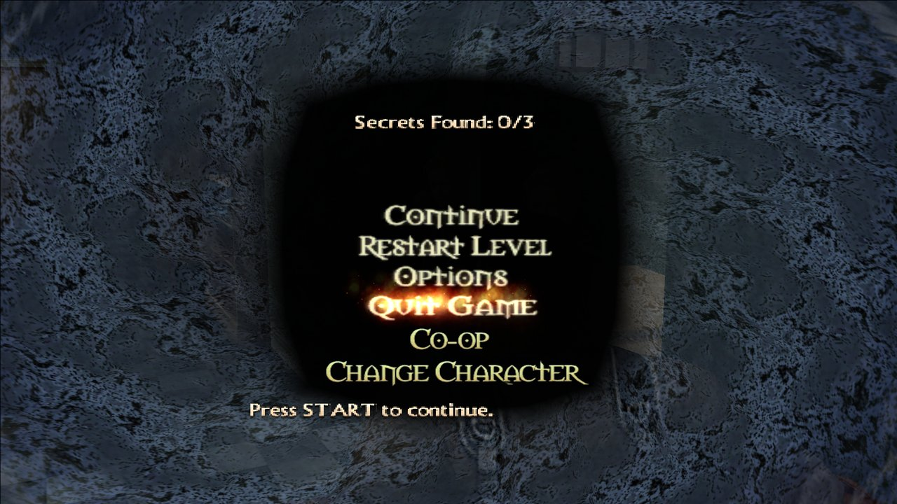<br><sub>Player 1's pause menu, with <b>Co-op</b> and <b>Change Character</b></sub></td>
  </tr>
</table>

| To… | Do this |
|---|---|
| **Join** | During a story level, press **Start** on controller 2. Pick a character with **A**, or back out with **B**. You appear next to player 1. |
| **Change character or drop out** (player 2) | Press **Start** on controller 2. Your menu has **Continue**, **Change Character** and **Drop Out**. |
| **Catch up** (player 2) | Press **Back** on controller 2 to teleport to player 1. |
| **Get back up** | If player 2 falls, they respawn beside player 1 a few seconds later. |
| **Co-op options** (player 1) | Pause, then choose **Co-op**. |

On player 1's **Co-op** page:

- **Screens**: *Two Windows*, *Split Screen* or *One Screen*. You can switch at any time. With two windows, drag player 2's window to another monitor or TV.
- **Friendly Fire**: whether the players can hurt each other.
- **Shared Inventory**: keys and items picked up by either player go into both inventories. Each player still selects their own item, and keeps their own spells and weapons.
- **Back Brings Player 2**: whether player 2's **Back** button teleports them.
- **Player 2 Respawn**: how long before player 2 gets back up.
- **Drop Out Player 2**: removes player 2 from the game.

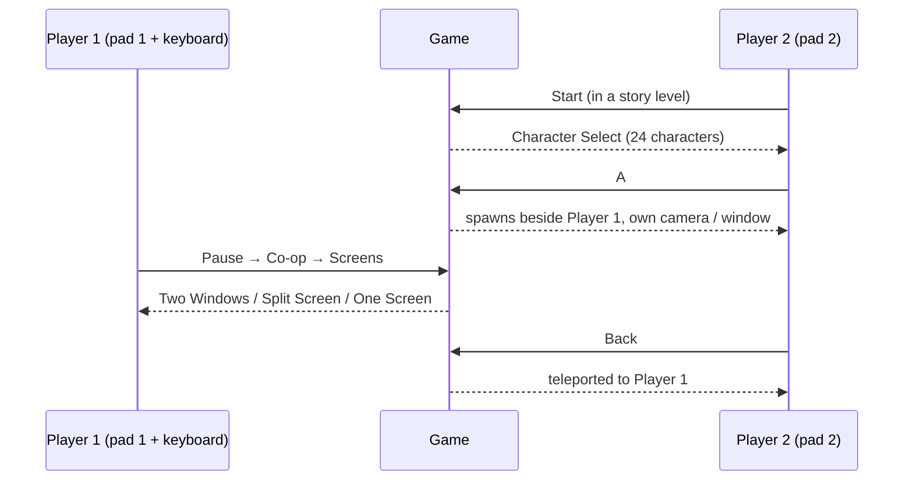

> Co-op is **early work**. The first mission has been played through; later levels haven't been tested yet. Cutscenes and menus show on both screens.

---

## Building from source

<p align="center">
  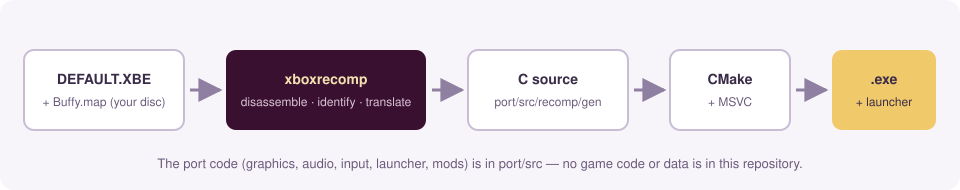
</p>

The translated game code is **generated on your machine from your own disc**. It isn't stored here.

**You need:**

- **Visual Studio 2019 Build Tools**: MSVC 14.29, x64.
- **CMake 3.20** or newer.
- **Git Bash**.
- **Python 3.12** with `capstone`: run `pip install capstone`.

**Steps:**

1. Unpack your disc into `game_files/` at the root of this repository. You need `DEFAULT.XBE`, `Buffy.map` and the `Buffy/` data folder. Either:
   - run xboxrecomp's unpacker:
     ```bash
     cd xboxrecomp && python -m tools.xiso unpack "path/to/your.iso" -o ../game_files
     ```
   - or install with a built launcher and copy the files across.
2. Generate the C code:
   ```bash
   bash port/tools/regen.sh
   ```
3. Build:
   ```bash
   cmake -S port -B port/build -A x64
   ```
   ```bash
   cmake --build port/build --config Release
   ```
4. Put a playable copy in `GAME/`, next to the build:
   ```bash
   bash port/tools/deploy.sh
   ```
   Or make a shareable folder that has no game data in it:
   ```bash
   bash port/tools/package.sh
   ```

**Repository layout:**

| Path | What's there |
|---|---|
| `port/src/` | The PC side: graphics, audio, input, movies, menus, settings, mods and co-op. |
| `port/launcher/` | The Win32 launcher (Play, Settings, Mods and Install tabs). |
| `port/mods/` | The bundled mods. |
| `port/tools/` | Regeneration, deploy and packaging scripts. |
| `xboxrecomp/` | The static recompiler and Xbox runtime. It's vendored with changes for this port. |

---

## Troubleshooting

- **The launcher says the disc image isn't Chaos Bleeds.** Only the **Xbox** version is supported, and the image must be a full disc image, not just the game partition.
- **There are no cutscene movies.** FFmpeg wasn't available during install. Get FFmpeg, then install again with **Convert the game's movies** ticked.
- **The game closed unexpectedly.** `buffy_log.txt` beside the exe records why. Please include it when you report a problem.
- **Player 2's window is missing.** On player 1's pause menu, go to **Co-op**, then **Screens**, and choose **Two Windows** again. The window opens on the primary screen, and you can drag it from there.

---

## Contributors

| | Who | What |
|---|---|---|
| 🧑‍💻 | [**KaikoClanworth1**](https://github.com/KaikoClanworth1) | Project lead: direction, design, testing and playing. |
| 🤖 | [**Claude Code**](https://claude.com/claude-code) (Anthropic) | AI coding assistant: wrote most of the port. That includes the recompiler integration, the Direct3D 11 renderer and runtime fixes, audio, input, movies, the launcher, the mods system and story co-op, plus the tools and this README. |
| 🛠️ | [**sp00nznet**](https://github.com/sp00nznet) | [xboxrecomp](https://github.com/sp00nznet/xboxrecomp), the static recompiler this port is built on. |

> **AI disclosure:** this port was developed with Claude Code. Its commits carry a `Co-Authored-By: Claude` line. Every change was run and tested on the project lead's own PC.

See [CONTRIBUTORS.md](CONTRIBUTORS.md).

---

## Legal and credits

- This is an unofficial fan project. It isn't affiliated with or endorsed by 20th Century Studios, Vivendi Universal Games, Eurocom or Microsoft. *Buffy the Vampire Slayer* and *Chaos Bleeds* belong to their respective owners.
- **No game material is included**: no disc image, XBE, data, audio, video or translated game code. You must own the game and supply your own disc image. The screenshots in `docs/screenshots/` were taken of the port running. They're used only to show the port, and they belong to the game's owners.
- **Recompiler**: [xboxrecomp](https://github.com/sp00nznet/xboxrecomp) by sp00nznet, under the MIT license. See `xboxrecomp/LICENSE` and `xboxrecomp/NOTICE`.
- **Disassembly**: [Capstone](https://www.capstone-engine.org/).
- **Movie conversion**: [FFmpeg](https://ffmpeg.org/). It's downloaded separately and isn't bundled.
